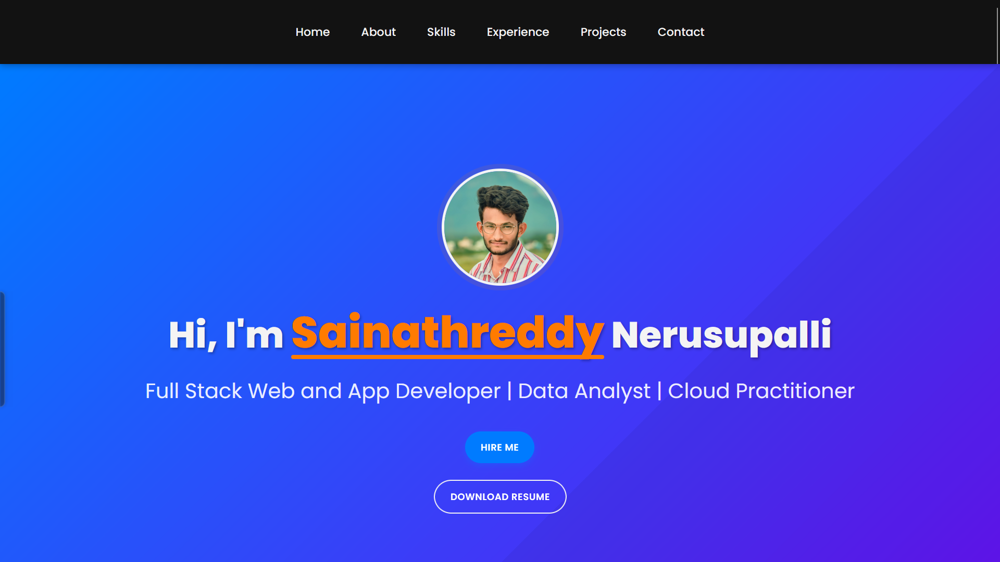

# 🚀 Sainathreddy Nerusupalli - Portfolio

  <h2>
    <a href="https://sainath-666.github.io/Portfolio/" target="_blank" rel="noopener noreferrer">
      🔗 LIVE DEMO
    </a>
  </h2>

  

## 📋 Overview

This is my personal portfolio website showcasing my skills, projects, and experience as a Full Stack Web and App Developer, Data Analyst, and Cloud Practitioner. The site is built with modern web technologies and features a responsive design that works seamlessly across all devices.

## ✨ Features

- **Responsive Design**: Optimized for all device sizes from mobile to desktop
- **Modern UI/UX**: Clean, professional interface with smooth animations
- **Project Showcase**: Highlighting my key projects with descriptions and links
- **Skills Section**: Visual representation of my technical skills
- **Contact Form**: Easy way for potential clients or employers to reach out
- **Interactive Elements**: Engaging user experience with hover effects and transitions

## 🛠️ Technologies Used

- HTML5
- CSS3 (with modern features like CSS variables, flexbox, and grid)
- JavaScript (ES6+)
- Google Fonts
- Responsive Design Principles

## 🔍 Sections

- **Home**: Introduction and call-to-action
- **About**: Personal background and education
- **Skills**: Technical competencies
- **Experience**: Professional background
- **Projects**: Portfolio of work
- **Contact**: Get in touch form

## 📱 Responsive Features

- Mobile-first approach
- Hamburger menu for smaller screens
- Flexible layouts that adapt to different screen sizes
- Optimized images and typography for all devices

## 🔗 Connect With Me

---

  
Made with ❤️ by Sainathreddy

